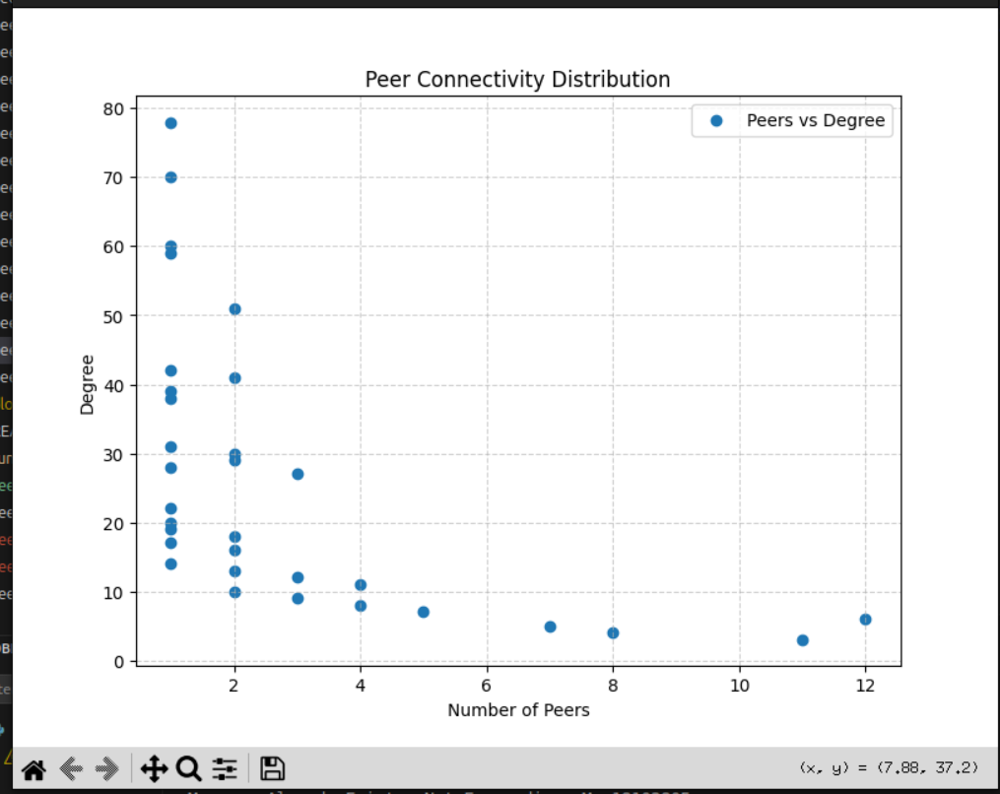

# Gossip Protocol Peer-to-Peer Network

This project implements a gossip-based peer-to-peer (P2P) network in C++. Peers register with seed nodes, exchange gossip messages, and periodically check the liveness of their connected peers. The system simulates a dynamic distributed network which follows PowerLaw where nodes can join, communicate, and detect failures.

## Features

- **Peer Registration:**  
  Peers register with a subset of seed nodes and receive a peer list.
  
- **Peer Selection:**  
  A subset of available peers is chosen based on a Power-Law distribution to mimic real-world network connectivity.

- **Gossip Messaging:**  
  Peers generate and propagate gossip messages throughout the network while preventing duplicate message forwarding.

- **Liveliness Checking:**  
  Periodically, each peer sends a liveliness (ping) message to its connected peers. If a peer fails to reply to three consecutive ping messages, it is considered dead.

- **Failure Notification:**  
  When a peer is declared dead, the node notifies the seed nodes, and the connection is closed.

- **Multithreading:**  
  Uses multiple threads to handle server operations, message propagation, and liveliness checks concurrently.

- **Logging:**  
  Logs all events and communications to a file (\`peer-<port>.txt\`).

## Requirements

- **Compiler:** C++11 (or later)
- **Platform:** POSIX-compliant system (e.g., Linux, macOS)
- **Libraries:** Standard C++ libraries for networking, threading, and file I/O
- **Python (Optional):** Required for Power-Law visualization (`matplotlib`, `networkx`, `numpy`)

## Compilation

To compile the project, use the following commands:

```bash
g++ -std=c++11 -pthread -o peer peer.cpp
g++ -std=c++11 -pthread -o seed seed.cpp
```

## Running the Project

We provide a shell script, ``run_p2p.sh``, to automate the setup of seed nodes and peers.

### Run the project using:

```bash
./run_p2p.sh
```

This script:
- Starts seed nodes on predefined ports.
- Spawns multiple peer nodes with different configurations.
- Ensures that each peer registers with available seed nodes.
- You can modify the script to adjust the number of peers and seed nodes.

**NOTE:**  
Make sure to update the script with your own IP address before running.

## Manual Execution

If you prefer to start the network manually:

1. **Start Seed Node(s):**  
  ```bash
   ./seed <seedPort>
   ```
   Example:
  ```bash
   ./seed 5000
   ```

2. **Start Peers:**  
  ```bash
   ./peer <selfIP> <selfPort> <config.txt>
 ```
   Example:
 ```bash
   ./peer 192.168.1.101 9001 config.txt
```

### Example `config.txt`

```
192.168.1.100:8000
192.168.1.102:8002
```

## How It Works

1. **Registration:**  
   The peer registers with a subset of seed nodes using a \`Register\` message and obtains a list of available peers.

2. **Peer Selection:**  
   Using a Power-Law distribution, the peer selects a subset of available peers from the received list.

3. **Connection Establishment:**  
   The peer establishes TCP connections with the selected peers.

4. **Gossip Propagation:**  
   Gossip messages are generated periodically and broadcast to all connected peers. Duplicate messages are filtered out.

5. **Liveliness Checking:**  
   A dedicated thread sends liveliness messages (pings) every 13 seconds. If a peer fails to reply to three consecutive liveliness messages, it is marked as dead.

6. **Failure Handling:**  
   When a peer is declared dead, the node notifies the seed nodes and closes the corresponding TCP connection.

## Visualization of Power-Law Distribution

We use Python to visualize the Power-Law distribution of peer connections. The script `plot.py` plots the degree distribution of peers:



```bash
python3 plot.py
```

This generates a graph of **Number of Nodes vs. Degree**, illustrating how peer connectivity follows a Power-Law distribution.

## Code Structure

- **peer.cpp:**  
  Implements the peer node logic.
- **seed.cpp:**  
  Implements the seed node logic.
- **run_p2p.sh:**  
  Automates the setup of the P2P network.
- **plot.py:**  
  Generates a visualization of the peer degree distribution.
- **config.txt:**  
  Lists available seed nodes.
-  **cleanup.sh:**  
  Cleans Output files

### Peer Class Methods:
  - `loadConfig()`: Loads seed node information from a file.
  - `registerWithSeeds()`: Registers the peer with seed nodes.
  - `SelectPeers()` & `PowerLaw()`: Selects a subset of peers based on a probability distribution.
  - `connectToPeers()`: Establishes TCP connections with selected peers.
  - `handleClient()`: Manages incoming messages from connected peers.
  - `broadcastMessage()` & `broadcasttoSeeds()`: Sends messages to all connected peers and seed nodes, respectively.
  - `startGossip()`: Generates and broadcasts gossip messages.
  - `Liveliness()`: Periodically checks the liveness of connected peers and handles node failures.
  - `report_liveliness()`: Implements the ping functionality over a temporary socket.
  - `report_dead()`: Notifies seed nodes and removes a dead peer from the peer list.


## Authors

- **Purmani Rahul Reddy** (B22CS041)  
- **Palugulla Venkata Maheswar Reddy** (B22BB029)  
